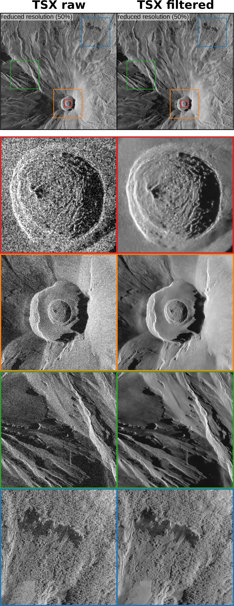

# Speckle2Speckle TerraSAR-X Filter

 

## Intro

This is a despeckling-filter for TerraSAR-X images based on convolutional networks. The code only contains the inference (application) part, not the training.

This is an initial test of applying the speckle2speckle deep learning approach to TerraSAR-X images. The filter has been trained on TerraSAR-X images of Colima volcano (Mexico) only. 

In case of questions contact:

* Andreas Ley (mail@andreas-ley.com)
* Sébastien Valade (valade@igeofisica.unam.mx)

If you use this in a publication, please consider citing us (see section *Credits* below).

Teaser image showing crops of a TerraSAR-X image before and after filtering (the image captures Popocatépetl volcano in Mexico, and is published in the Supplementary Material of Valade et al., Nature Communications): 

## Dependencies

The code is CPU only and thus does not need a GPU or associated drivers. It does, however, need AVX extensions which should be present in every x86(_64) cpu from the last decade. If in doubt, check with:

    cat /proc/cpuinfo | grep avx

The code is very much self contained and only needs an OpenMP capable C/C++ compiler and libTiff. A cmake file for building is also provided.

## Setup

Install the following dependencies:

* gcc
* cmake
* libtiff (development packages)

E.g. for ubuntu:

    sudo apt install gcc cmake libtiff5-dev

Or on fedora:

    sudo dnf install gcc cmake libtiff-devel

Create a subdirectory for an out-of-source build:

    mkdir buildRelease
    cd buildRelease

Run cmake:

    cmake .. -DCMAKE_BUILD_TYPE=Release

Build:

    make -j 8

This should build an executable "applicationCPU" in the "buildRelease" directory.

## Usage

The program ingests a (geo-)tiff image which must be the complex valued hh component in radar coordinates. Usually this is stored as two 16-bit integer values. The program can also ingest other data types (e.g. floats) but the value range/scaling must be the same.

The program outputs the filtered log-intensity values as a tiff image with float values which is intended for further processing. For visualization purposes it also outputs 8-bit images of the input and output. These are only intended for visualization and are not to be used for further processing. If you base your research on low quality 8-bit images with arbitrary tonemapping, you have none to blame but yourself!

The program takes two arguments. The filename of the source tiff image and a prefix for the output. Running it like so:

    ./applicationCPU /path/to/Popo/track_136_ASC_spot_090_20190425_004720.tif Popo_track_136_ASC_spot_090_20190425_004720

will produce these three files:

* Popo_track_136_ASC_spot_090_20190425_004720.tif   -- Filtered log intensity output
* Popo_track_136_ASC_spot_090_20190425_004720_before.tif   -- Visualization of input image
* Popo_track_136_ASC_spot_090_20190425_004720_after.tif   -- Visualization of output image

## Data source
TerraSAR-X raw products used for training were provided by the German Aerospace Center (DLR) to Prof. Thomas R. Walter (GFZ-Potsdam), under the project TSX-ID 1505. 

## Credits
The filter (version 1.0) was developped as part of a publication by Valade et al., accepted for publication in journal <i>Nature Communications</i> (2023-apr). Complete reference to the paper will be provided here in upon its publication. Version 1.0 of this code is archived on Zenodo, and therefore is citable through it own DOI.

## License

    Speckle2Speckle based despeckling filter for TerraSAR-X Spotlight mode
    Copyright (C) 2020  Andreas Ley <mail@andreas-ley.com>

    This program is free software: you can redistribute it and/or modify
    it under the terms of the GNU General Public License as published by
    the Free Software Foundation, either version 3 of the License, or
    (at your option) any later version.

    This program is distributed in the hope that it will be useful,
    but WITHOUT ANY WARRANTY; without even the implied warranty of
    MERCHANTABILITY or FITNESS FOR A PARTICULAR PURPOSE.  See the
    GNU General Public License for more details.

    You should have received a copy of the GNU General Public License
    along with this program.  If not, see <https://www.gnu.org/licenses/>.
